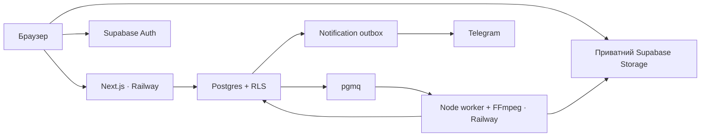

# amo / відеопростір

Командний Kanban і однодоріжковий відеоредактор: завантаження → визначення сцен → монтаж → окремі рендери v1/v2 → review → done.

**Live demo:** https://amo-web-production.up.railway.app — Railway Free (web + worker), окремий Supabase Free. Репозиторій: https://github.com/dxhod/amo-video-tasks, перевірений реліз `24d6394`. Пройшли cloud analysis, незалежні MP4, монтаж і review двома користувачами, Gmail підтвердження та відновлення пароля. 2026-09-08 перевірено 1080p/4K на Railway і Telegram-алерт для пошкодженого відео. Дані входу для власника — `.local/live-demo.json` (gitignored); локальні акаунти з `.local/demo.json` окремі. Фактичні результати й залишкові перевірки — [TEST_RESULTS](docs/TEST_RESULTS.md).

## Архітектура



- Два процеси ізолюють рендер від HTTP; монорепозиторій використовує спільні TypeScript/Zod-контракти.
- Команди, фіксація знімка монтажу і постановка в чергу атомарні. Browser не може напряму змінити статус або обійти перевірку прав на монтаж.
- Таймлайн містить інтервали кадрів `[start,end)` канонічного відео 30 fps. Фрагменти можна переставляти, обрізати, розрізати та видаляти.
- У статусі «У роботі» можна редагувати будь-яку версію, зокрема вже відрендерену. «На перевірці» та «Готово» блокують усі версії; активний рендер тимчасово блокує відповідну версію. Ревізія змінюється під час збереження монтажу. Job і MP4 прив’язані до конкретної ревізії; попередні файли залишаються в історії. Старий рендер не змінює статус актуального монтажу.
- Успішний рендер залишає задачу в «У роботі». Виконавець обирає будь-яку готову версію та натискає наявну кнопку «Передати на перевірку». На перевірці доступні тільки «Оригінал» і передана версія; після повернення на доопрацювання знову доступна вся історія. Після прийняття у «Готово» відображається лише прийнята версія. Ці обмеження діють у API, RLS і Storage.
- Queue lease, heartbeat і fencing спроб захищають від повторного виконання та рестарту worker. Унікальний шлях кожної спроби зберігає результати попередніх версій.

Докладніше: [рішення й обмеження](docs/DECISIONS.md), [навігація проєктом](PROJECT_MAP.md).

## Локальний запуск

Потрібні Node.js 24.13.1+, npm, запущений Docker Desktop і FFmpeg/ffprobe у PATH. Версії npm-залежностей закріплені lockfile.

```sh
npm ci
npm run db:start
node scripts/local-env.mjs
npm run dev
```

В іншому терміналі з кореня репозиторію:

```sh
npm run worker
```

- Застосунок: http://localhost:3000
- Supabase Studio: http://127.0.0.1:54323
- Локальні листи підтвердження/відновлення: http://127.0.0.1:54324

`local-env.mjs` читає **тільки локальну** конфігурацію Supabase і записує gitignored `.env` та `apps/web/.env.local`, не друкуючи ключів. Існуючі файли не перезаписуються без `--replace-local`.

Реєстрація потребує підтвердження email. Адміністратор проєкту може додати колегу за точним email після реєстрації та підтвердження. У задачі призначаються виконавець і рев’юер. Адміністратор може виконувати обидві ролі.

### Видалення та відновлення задач

Адміністратор відкриває задачу → «Видалити задачу» → підтверджує дію. Задача зникає з дошки та основної статистики. Відео, версії, коментарі й історія зберігаються; фізичного видалення файлів немає.

Для відновлення: «Статистика» → «Видалені задачі» → «Відновити». Задача повертається з поточним статусом. Вже запущена обробка завершується у фоні та зберігає результат, але сама не відновлює видалену задачу. Нові зміни до відновлення заблоковані. Видалення і відновлення доступні лише адміністратору та записуються в історію.

Адміністратор також може натиснути «Видалити проєкт» на його дошці й підтвердити дію. Увесь проєкт приховується від команди, дані та файли зберігаються. Відновлення: «Усі проєкти» → «Видалені проєкти» → «Відновити проєкт». Окремо видалені задачі залишаються видаленими після відновлення проєкту.

Для повторного монтажу поверніть задачу в «У роботі» та оберіть потрібну версію. Перше збереження змін уже відрендерованого монтажу автоматично створює нову актуальну версію; попередні таймлайн і MP4 зберігаються. Подальші зміни чернетки зберігаються в ній до запуску рендера. «Нова версія з цієї» також створює окрему копію вручну. Повторний Render без змін повертає наявне завдання або результат.

«Оригінал» зберігає початковий монтаж з автоматично визначених сцен. Його редагування створює копію. Для вже завантажених відео міграція відновлює цей монтаж зі сцен (за їх відсутності — з повного відео).

Іконка кошика з’являється при наведенні на версію або переході до неї клавіатурою; на вузьких екранах вона видима постійно. Виконавець або адміністратор може підтвердити видалення у статусі «У роботі». Оригінал і версію з активним рендером видаляти не можна. Видалення м’яке: версія зникає зі списку, файли зберігаються. При видаленні актуальної версії вибирається попередня доступна.

### Демонстраційний простір

За відсутності окремо запущеного worker:

```sh
npm run seed:demo
```

Seed створює локальні випадкові облікові дані, проєкт, тестове відео й два справжні рендери. Облікові дані записуються в `.local/demo.json` і не потрапляють у git. Команда відмовляється працювати з зовнішнім Supabase. Повторний запуск створює новий демонстраційний проєкт.

Production web у Docker доступний на `http://127.0.0.1:3100`; локальні демо-акаунти ті самі. Контейнерний E2E із двома MP4 та review пройшов. Публічний Railway URL наведено на початку README.

## Конфігурація

| Змінна | Призначення |
|---|---|
| `NEXT_PUBLIC_SUPABASE_URL` | URL Auth/Storage/Data API для web |
| `NEXT_PUBLIC_SUPABASE_PUBLISHABLE_KEY` | Публічний ключ із RLS; локально підтримується anon key |
| `NEXT_PUBLIC_APP_URL` | Адреса застосунку для email redirect |
| `SUPABASE_URL` | Адреса Supabase для серверних процесів |
| `SUPABASE_SERVICE_ROLE_KEY` | Привілейований ключ, тільки сервер/worker |
| `TELEGRAM_BOT_TOKEN`, `TELEGRAM_CHAT_ID` | Адресат критичних помилок |
| `FFMPEG_PATH`, `FFPROBE_PATH` | Необов’язкові шляхи до бінарників |
| `ALLOW_LOCAL_TESTS` | `true` лише для одноразового локального середовища тестів |

Зразок — `.env.example`. Без Telegram credentials outbox зберігає повідомлення для подальшої доставки, відеопайплайн продовжує роботу.

## Перевірки

```sh
npm run lint
npm run typecheck
npm test
npm run test:integration
npx playwright install chromium
npm run test:e2e
npm run build
```

Unit/FFmpeg тести потребують встановлених FFmpeg/ffprobe. Інтеграційні й E2E тести потребують локального Supabase та `.env`, створеного helper-скриптом. Перед інтеграційними тестами зупиніть звичайний worker: suite сам керує чергою. E2E запускає web і worker автоматично. Дані тестів залишаються у локальній БД; `npm run db:reset` повністю скидає **локальне тестове середовище**, не використовуйте його для потрібних даних.

| Edge case | Очікування | Перевірка / фактичний статус |
|---|---|---|
| Сцени переставлено та обрізано | Правильний порядок і кількість кадрів у MP4 | `apps/worker/src/media.test.ts`; результати в TEST_RESULTS |
| Відео без звуку | Валідний MP4 без звернення до відсутнього потоку | FFmpeg tests |
| Вертикальне відео | Збережені пропорції без збільшення | FFmpeg tests |
| Пошкоджений файл / понад 30 с | Оброблена помилка, відсутність результату | FFmpeg tests |
| Немає зміни сцен | Одна сцена на весь ролик | Shared timeline tests |
| Дві вкладки редагують версію | Конфлікт ревізії без втрати серверного стану | Supabase integration |
| Подвійний Render | Один job і один результат | Supabase integration |
| Старий рендер завершився після створення v2 | v1 зберігається; статус актуальної задачі не змінюється | Supabase integration |
| Worker втратив lease | Стара спроба відхилена, нова може завершити job | Supabase integration |
| Сторонній користувач | Відсутність доступу до проєкту і файлів | Supabase integration |
| Повернення review без коментаря | Відмова; задача залишається на review | Supabase integration |
| Telegram недоступний | Помилка збережена, доставка повторюється окремо | Notification test / live окремо |
| Обірваний upload | TUS відновлює той самий файл; помилка відображається | PASS: `tests/e2e/upload-resume.spec.ts`, продовження після 6 MiB та reload |

### Фактичні edge cases перед здачею, 2026-09-08

| Сценарій | Очікував | Що сталось | Обробка |
|---|---|---|---|
| 1080p, 6 фрагментів у зворотному порядку, 512 MiB | Рендер без завершення процесу через пам’ять | Початковий graph не вклався; послідовний рендер пройшов, peak 255 MiB у Docker; live MP4 12 с готовий | Виправлено і перевірено |
| Джерело 4K без звуку | Зменшення до 1080p, готовий монтаж | Docker peak 304 MiB; Railway analyze/render з першої спроби, MP4 8 с | Коректно |
| Пошкоджений MP4 у live | Помилка, без результату, лог та Telegram | INVALID_MEDIA; stack/user/task збережені, Telegram прийняв алерт приблизно через 2 с | Коректно, worker працює |
| Однокадрові склейки, зі звуком/без | Точна кількість кадрів | Обидва результати мають 6 кадрів і декодуються без помилок | Коректно |
| Переставлені звукові сигнали | Звук рухається разом із відео | 880 Hz перед 440 Hz у результаті, порядок підтверджено тестом | Коректно |
| DnD та reload | Новий порядок збережений | Pointer drag і keyboard reorder пройшли, після reload порядок збережено | Коректно |

Повні свідчення, інші кейси та межі перевірки наведені в [TEST_RESULTS](docs/TEST_RESULTS.md). Відновлення TUS і втрата lease перевірені локально/CI; примусовий restart під час job у live окремо не виконувався.

## API та обслуговування

- `GET /api/projects`, `/api/projects/:id`, `/api/tasks/:id`, `/api/jobs/:id`, `/api/admin/:projectId` — дані, обмежені правами користувача.
- `POST /api/commands` — `{ action, payload }`; авторизовані операції з проєктами, задачами, upload, версіями, рендером і коментарями. Render та upload.complete приймають idempotency `key`.
- `POST /api/upload-errors` — обмежена за розміром і частотою фіксація клієнтського збою.
- `GET /api/health` — доступність HTTP-сервісу.
- Помилки: `{ code, message, request_id }`; конфлікти ревізій повертають HTTP 409. Stack trace доступний лише в адмінці.

Очищення незадіяних результатів старших 24 годин: `npm run cleanup` для перегляду, `npm run cleanup -- --apply` для застосування. Активні jobs, referenced результати та вихідні файли зберігаються.

## Деплой і комплект здачі

[Інструкція Railway/Supabase](docs/DEPLOYMENT.md) містить порядок міграцій, змінні, healthcheck і live smoke-test. Dockerfile та окремі Railway-конфігурації готові для двох сервісів.

- GitHub: https://github.com/dxhod/amo-video-tasks (приватний; потрібен доступ для перевіряючого).
- Railway: https://amo-web-production.up.railway.app.
- [Матриця вимог і сценарій демонстрації](docs/ACCEPTANCE.md).
- [Журнал часу](docs/TIME_LOG.md).
- [Рішення й виправлення під час роботи з AI](docs/AI_WORK_LOG.md) та [експорт видимих повідомлень реальної сесії](docs/AI_SESSION_EXCERPT.md).

За більшого часу: undo/redo, стабільніший безшовний preview через браузерний композитор, окрема музика, налаштування порогу scene detection, запрошення email, пагінація для великих проєктів, cost/retention-політика та окремі production-алерти доступності.
