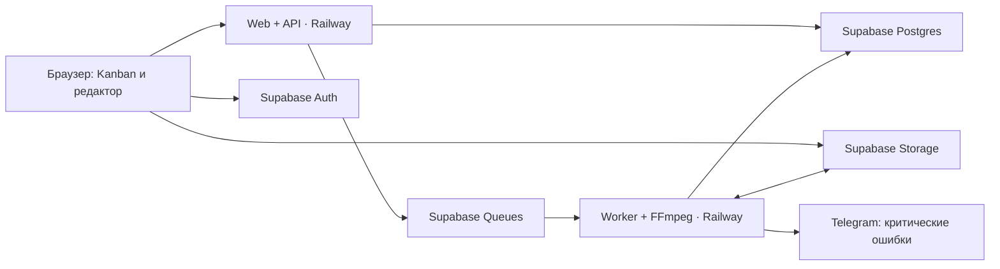

# Витяг з реальної сесії AI

Session: 01a076fe-d326-7a02-a5f1-051b1e8c9388

Експорт лише повідомлень користувача й видимих відповідей асистента. Системні інструкції, reasoning і виводи інструментів виключені. Дублікат затвердженого плану скорочено з явною позначкою.

## Користувач · 2026-09-06T13:54:16.228Z

Есть такое тестовое задание [https://app.notion.com/p/amo-tech/AI-Automation-Engineer-3d1e4011cc538037afc1e6a76b169c91](https://app.notion.com/p/amo-tech/AI-Automation-Engineer-3d1e4011cc538037afc1e6a76b169c91)

Какие варианты архитектуры можешь предложить для его реализации?

## Асистент · 2026-09-06T13:54:26.277Z

Прочитаю задание и контекст проекта, затем предложу варианты архитектуры с их плюсами, ограничениями и сложностью реализации.

## Асистент · 2026-09-06T13:55:00.501Z

Подключение Notion не видит эту страницу. Использую навык Browser, чтобы попробовать прочитать задание по ссылке в браузере.

## Асистент · 2026-09-06T13:55:26.915Z

Задание прочитано: обязательны GitHub, Supabase и Railway, а главный приоритет — редактируемый таймлайн, отдельные версии монтажа и рендер через FFmpeg. Сравню три подхода; ключевой выбор здесь — где выполнять обработку видео и как хранить версии, чтобы повторный рендер не перезаписывал предыдущий результат.

## Асистент · 2026-09-06T13:56:35.126Z

Я бы выбрал **один репозиторий, веб-приложение и отдельный worker для FFmpeg, с очередью в Supabase**. Для этого тестового это хороший баланс: обработка видео изолирована от интерфейса, а инфраструктура остаётся небольшой.

Прочитал [задание](https://app.notion.com/p/amo-tech/AI-Automation-Engineer-3d1e4011cc538037afc1e6a76b169c91): GitHub, Supabase и Railway обязательны; основной приоритет — таймлайн, версии монтажа и рендер. Требования добавлять LLM в само приложение нет.

**Варианты архитектуры**

| Вариант | Состав | Преимущества | Ограничения |
|---|---|---|---|
| **1. Компактный монолит** | React + Node.js API + обработчик FFmpeg в одном сервисе Railway; Supabase для данных и файлов | Самый простой запуск и деплой | Рендер конкурирует с API за ресурсы; рестарт затрагивает всё приложение |
| **2. Web + отдельный worker — рекомендую** | Next.js на Railway; отдельный Node.js worker с FFmpeg; Supabase Auth, Postgres, Storage и Queues | Изоляция рендера, восстановление заданий, общие TypeScript-типы, без Redis | Нужно корректно реализовать очередь, повторные попытки и состояния |
| **3. Отдельные frontend, API и worker** | React + FastAPI + Python worker; Redis/Celery; Supabase | Удобно развивать обработку медиа на Python и независимо масштабировать компоненты | Больше сервисов, два языка и больше интеграционной работы |

В первом варианте задания всё равно нужно хранить в БД: очередь только в памяти будет теряться при рестарте. Третий оправдан при планах на более сложную обработку видео; для текущего объёма я считаю его избыточным.

**Как устроить рекомендуемый вариант**

Supabase Queues предоставляет постоянную очередь на базе Postgres с временным резервированием сообщения за обработчиком. Это позволяет обойтись без отдельного Redis, но обработчик всё равно должен безопасно переносить повторное выполнение задания. [Документация Queues](https://supabase.com/docs/guides/queues)

Распределение ответственности:

- **Web:** авторизация, проекты, Kanban, комментарии, редактор, создание версий и запросов на рендер.
- **Worker:** проверка видео, определение длительности, детекция сцен, миниатюры, рендер и фиксация результата.
- **Supabase:** пользователи, права доступа, данные, очередь и файлы.
- **GitHub:** код, миграции, проверки и Docker-конфигурация.

Исходники и результаты я бы хранил в закрытых bucket’ах Supabase, с доступом по членству в проекте. Storage поддерживает политики доступа через RLS. [Документация](https://supabase.com/docs/guides/storage/security/access-control)

На Railway нужны только временные рабочие файлы FFmpeg: постоянное хранение нельзя привязывать к обычной файловой системе контейнера, которая является временной. [Документация Railway](https://docs.railway.com/services)

**Главное архитектурное решение — модель монтажа**

Таймлайн должен хранить **инструкции монтажа**, например: «взять секунды 8–12 исходника, затем секунды 0–4». Перестановка или разрезание сцены меняет эти инструкции; исходное видео остаётся целым.

Для тестового я бы предложил одну видеодорожку со связанным звуком:

- перетаскивание для изменения порядка;
- изменение начала и конца фрагмента;
- разрезание по позиции курсора;
- миниатюры, шкалу времени и предпросмотр;
- создание v2 копированием таймлайна v1.

Это предположение о границах редактора стоит явно записать в README: многодорожечность, эффекты и переходы в задании не указаны.

При запуске рендера сохраняется **неизменяемый снимок таймлайна**. Результат привязывается к конкретной версии и этому снимку. Тогда редактирование во время обработки не приведёт к ситуации, когда MP4 соответствует уже другому монтажу.

FFmpeg умеет определять смены сцен, обрезать видео и аудио, а затем соединять фрагменты. Для произвольных точек разреза я бы выбрал перекодирование, чтобы обеспечить точность монтажа. [Документация фильтров FFmpeg](https://ffmpeg.org/ffmpeg-filters.html)

**Данные и состояния**

Минимально нужны:

| Сущность | Что хранит |
|---|---|
| `projects`, `project_members` | Проекты и доступ |
| `tasks`, `comments` | Карточки, исполнители и обсуждения |
| `media_assets` | Исходник, длительность, сцены, миниатюры |
| `edit_versions` | Версии и таймлайны |
| `processing_jobs`, `renders` | Этапы обработки, попытки, снимки монтажа и результаты |
| `error_logs` | Ошибки с этапом, типом, stack trace и идентификаторами |

**Статус карточки и статус обработки нужно разделить.** Например, карточка остаётся `in progress`, пока рендер проходит `queued → running → succeeded/failed`.

Переход в `review` выполняется после сохранения готового результата выбранной версии. Завершившийся позже старый рендер не должен менять статус карточки или заменять актуальное видео. Длительность исходника и финального монтажа также стоит хранить отдельно.

Для админки достаточно SQL-запросов: выполненные задачи по исполнителю, среднее время непосредственно рендера и фильтрация ошибок. Критические ошибки должны записываться в `error_logs` и запускать немедленную попытку Telegram-уведомления; сбой Telegram не должен мешать сохранению самой ошибки.

**Что сделает решение убедительным на сдаче**

Я бы сначала довёл один полный сценарий: **загрузка → автосцены → ручной монтаж → v1 → рендер → v2 → отдельный рендер → review**. Затем добавил админку и проверил:

- повреждённое видео, видео без аудио и без смен сцен;
- превышение лимита 30 секунд;
- двойное нажатие Render и рестарт worker;
- изменение таймлайна во время рендера;
- одновременную обработку разных версий;
- недоступность Storage или Telegram;
- запрет доступа к чужому проекту.

Именно корректность этих сценариев, удобный таймлайн и воспроизводимый live-деплой дадут здесь больше, чем дополнительное количество сервисов.

## Користувач · 2026-09-06T14:31:17.449Z

Тогда давай реализуем второй вариант. Распиши подробный план реализации

## Асистент · 2026-09-06T14:31:26.413Z

Подготовлю подробный план второго варианта: Next.js и отдельный worker с FFmpeg на Railway, Supabase для авторизации, данных, файлов и очереди. Сначала проверю состояние папки проекта, затем уточню границы редактора и совместной работы — от них зависят модель данных и объём реализации.

## Асистент · 2026-09-06T14:43:28.900Z

Папка проекта пустая, существующих ограничений по коду нет. Зафиксировал: полный объём тестового, командные проекты и одна дорожка с одним исходником на задачу. В плане разделю статус карточки, состояние версии и состояние фонового задания, чтобы завершение старого рендера не отправляло на review новый, ещё неготовый монтаж.

## Асистент · 2026-09-06T14:56:49.246Z

<proposed_plan>

# План реализации AMO Video Tasks

## 1. Результат и архитектура

Создать приложение с интерфейсом и README на украинском: командные проекты, Kanban, загрузка видео, автоматическое определение сцен, ручной монтаж, независимые версии, фоновый рендер, review, админка и Telegram-уведомления.

Основной сценарий приёмки: исполнитель загружает видео, меняет монтаж, получает рендер v1, создаёт отличающуюся v2, получает отдельный результат и передаёт его ревьюеру. Предыдущая версия сохраняется.

**Зафиксированные границы:**

- Один исходник на задачу, одна видеодорожка со связанным звуком.
- Перестановка, обрезка и разрезание сцен; без эффектов, переходов и отдельных аудиодорожек.
- До первого запуска рендера версия редактируется. После запуска фиксируется; изменения выполняются в новой версии.
- Командные проекты с назначением исполнителя и ревьюера.
- Полный объём тестового, включая live-деплой и документирование проверок.

**Стек:**

| Компонент | Решение |
|---|---|
| Интерфейс и API | Next.js App Router, TypeScript |
| UI | Tailwind CSS, shadcn/ui |
| Перетаскивание | dnd-kit; собственный компонент таймлайна |
| Состояние редактора | Zustand; TanStack Query для серверных данных |
| Проверка входных данных | Zod; общие схемы для web и worker |
| Обработка видео | Node.js worker, системные FFmpeg и ffprobe |
| Авторизация, данные, файлы | Supabase Auth, Postgres, Storage |
| Очередь | Supabase Queues / pgmq |
| Проверки | Vitest, Playwright, интеграционные проверки Supabase и FFmpeg |
| Развёртывание | Два Docker-сервиса Railway из одного GitHub-репозитория |

Репозиторий организовать через npm workspaces: `apps/web`, `apps/worker`, `packages/shared`. Добавить миграции Supabase, Docker-конфигурацию, локальные инструкции и компактный PROJECT_MAP.

Web принимает команды пользователя и возвращает идентификаторы фоновых заданий. Worker забирает задания из очереди, обрабатывает файлы и сохраняет результаты. Supabase Queues позволяет использовать постоянную очередь в Postgres без отдельного Redis. [Документация](https://supabase.com/docs/guides/queues)

## 2. Данные, права и правила работы

### Авторизация и командные проекты

Использовать Supabase Auth: email/password, подтверждение email, вход, выход и восстановление пароля. Сервер проверяет подлинность сессии через официальный SSR-подход Supabase. [Документация](https://supabase.com/docs/guides/auth/server-side/nextjs)

- Зарегистрированный пользователь может создать проект и становится его администратором.
- Администратор добавляет уже зарегистрированного пользователя по точному email. Общего поиска по пользователям нет.
- Только участники видят проект, задачи, комментарии и видео.
- Администратор управляет участниками и назначениями.
- Исполнитель редактирует монтаж и запускает обработку; ревьюер принимает результат или возвращает задачу.
- Администратор может выполнять действия исполнителя и ревьюера.
- Админка показывает данные только проектов, которыми пользователь управляет.

RLS включить для всех прикладных таблиц и файлов. Привилегированные ключи доступны только серверной части и worker. Бизнес-переходы выполнять через проверяемые серверные операции; скрытие кнопок не заменяет проверку прав.

### Основные сущности

| Сущность | Назначение |
|---|---|
| `profiles` | Отображаемые данные пользователя |
| `projects`, `project_members` | Проекты, участники и роли |
| `tasks` | Карточка, статус, исполнитель, ревьюер, актуальная версия |
| `task_events` | История переходов и данные для статистики |
| `comments` | Комментарии с автором и временем |
| `media_assets` | Исходник, подготовленное видео, длительность и параметры |
| `detected_scenes` | Найденные границы сцен и миниатюры |
| `edit_versions` | Номер версии, таймлайн, ревизия и момент фиксации |
| `processing_jobs` | Этап обработки, состояние, попытки и время выполнения |
| `renders` | Результат рендера, версия, путь к файлу и длительность |
| `error_logs` | Время, этап, тип, сообщение, stack trace, пользователь, задача и job |
| `notification_outbox` | Доставка Telegram-уведомлений и повторные попытки |

Ссылки между версиями, исходниками и задачами проверяются в БД. Номер версии уникален внутри задачи и назначается атомарно.

### Версии и статусы

Таймлайн хранить как упорядоченный список клипов: стабильный ID, ID исходника, начальный и конечный кадры. Конечная граница исключается; минимальная длина — один кадр. Позиция на итоговой дорожке вычисляется из порядка и длительности клипов.

Редактирование сохраняется с номером ревизии. При конфликте двух вкладок сервер возвращает `409`, интерфейс предлагает загрузить актуальное состояние. Последняя запись не должна молча уничтожать чужие изменения.

Создание рендера одной транзакцией:

1. Проверить права, ревизию и корректность таймлайна.
2. Зафиксировать версию и снимок монтажа.
3. Создать задание и сообщение очереди.

Повторное нажатие Render возвращает существующее активное задание. Неудачный рендер можно повторить для того же снимка. Для изменения монтажа создаётся следующая версия копированием выбранной.

Статусы разделить:

- Карточка: `todo → in_progress → review → done`.
- Задание: `queued → running → succeeded / failed`.
- Версия: редактируемый черновик или зафиксированная версия; состояние рендера показывается отдельно.

Первый запуск обработки переводит `todo` в `in_progress`. Успешный рендер **актуальной версии** переводит карточку в `review` после сохранения файла. Рендер старой версии сохраняет результат, но не меняет карточку.

Ревьюер переводит `review → done` либо возвращает в `in_progress` с обязательным комментарием. Создание новой версии во время review возвращает работу в `in_progress`. Завершённую задачу сначала явно переоткрывает администратор.

Хранить длительность исходника и каждого результата отдельно. В карточке показывать длительность актуального готового монтажа; до его появления — длительность исходника с соответствующей подписью.

## 3. Последовательность реализации

### Этап 1. Каркас и ранняя проверка видеопайплайна

- Создать workspace, web, worker, общие типы, настройки TypeScript, lint и тестов.
- Подготовить Docker-образы; worker включает закреплённую сборку FFmpeg.
- Создать начальные миграции и закрытые Storage-bucket’ы.
- Реализовать минимальный технический проход: файл в Storage → очередь → worker → FFmpeg → результат в Storage.
- Проверить его в Railway до разработки сложного редактора: доступность бинарников, соединений и достаточность ресурсов.

**Готовность:** небольшой тестовый ролик обрабатывается в целевой среде, job получает результат, файл воспроизводится.

### Этап 2. Авторизация, проекты и Kanban

- Реализовать страницы авторизации, списка проектов и управления участниками.
- Добавить создание задачи: название, описание, исполнитель и ревьюер.
- Реализовать четыре колонки Kanban и карточку задачи.
- Перетаскивание вызывает те же проверки переходов, что и кнопки действий.
- Недопустимый переход отклоняется с понятным объяснением; оптимистическое изменение интерфейса откатывается.
- Подготовить демонстрационный проект через отдельный seed, не создавая публичных общих учётных данных.

**Готовность:** два участника видят общий проект, посторонний пользователь не получает к нему доступ.

### Этап 3. Загрузка и автоматический анализ

Принимаемые файлы: MP4, MOV и WebM, до 50 MiB и до 30 секунд. Ограничения показать до выбора файла и повторно проверить на сервере. Наличие видеопотока и реальный формат проверять через ffprobe.

Загрузка напрямую в Supabase Storage через TUS с прогрессом и возобновлением после обрыва. Большие файлы не проходят через Next.js API. [Документация](https://supabase.com/docs/guides/storage/uploads/resumable-uploads)

Порядок обработки:

1. Создать разрешённую upload-сессию с уникальным путём.
2. Загрузить файл.
3. Подтвердить наличие объекта и создать задание анализа.
4. Через ffprobe проверить длительность, потоки и параметры.
5. Подготовить канонический MP4: H.264, 30 fps, AAC при наличии звука; учитывать поворот и сохранять пропорции. Длинная сторона — максимум 1920 пикселей, без увеличения исходника.
6. Определить смены сцен через FFmpeg `scdet`.
7. Нормализовать границы, убрать пустые интервалы, добавить начало и конец видео.
8. Создать миниатюры и начальную версию v1.

Каноническое видео используется для предпросмотра и монтажа: границы в кадрах соответствуют одному и тому же медиаресурсу. Если смены сцен не найдены, весь ролик становится одной сценой.

После успешного анализа исходник неизменяем. До успеха разрешена повторная загрузка после ошибки.

**Готовность:** загруженный ролик автоматически появляется в редакторе как набор сцен с корректной длительностью.

### Этап 4. Редактор таймлайна

Экран задачи разделить на плеер, таймлайн, панель выбранного клипа и список версий.

Реализовать:

- Шкалу времени, playhead, миниатюры и выделение клипа.
- Перестановку сцен drag&drop с автоматическим смыканием дорожки.
- Обрезку краёв мышью и точный ввод границ.
- Split по playhead и удаление выбранного фрагмента.
- Предпросмотр в порядке монтажа с переводом времени дорожки во время исходника.
- Автосохранение через 700 мс после изменения; перед рендером обязательно дождаться сохранения.
- Индикаторы сохранения, обработки и ошибок.
- Создание новой версии копированием; просмотр зафиксированных версий без редактирования.

Редактор рассчитан прежде всего на desktop. На узком экране доступны карточки и просмотр результатов; полноценный мобильный монтаж не входит в первую версию.

Предпросмотр на HTML-video может иметь небольшую паузу при переходе между фрагментами. Готовый MP4 служит точным результатом монтажа; это ограничение указать в README.

**Готовность:** пользователь меняет порядок сцен, обрезает и разрезает их; после перезагрузки страницы монтаж сохраняется.

### Этап 5. Рендер и восстановление заданий

Worker строит FFmpeg filtergraph из проверенного снимка: обрезка видео и звука, сброс timestamps, конкатенация, кодирование MP4. Для файлов без звука используется отдельная ветка без обращения к отсутствующему аудиопотоку.

- Запускать FFmpeg через аргументы процесса, без shell.
- Сначала разрешить один тяжёлый job на worker.
- Visibility timeout очереди — 120 секунд; heartbeat и продление резервирования — каждые 20 секунд.
- Предельное время одной обработки — 10 минут; при превышении завершать дочерний процесс.
- Временные инфраструктурные ошибки повторять максимум три раза с задержками 10 и 30 секунд. Некорректное видео и таймлайн автоматически не повторять.
- Фиксировать номер попытки и проверять его при завершении: опоздавшая попытка не может заменить результат актуальной.
- Каждая попытка пишет файл по уникальному пути. Готовым считается только объект, проверенный после загрузки и привязанный к результату в БД.
- Подтверждать сообщение очереди после фиксации результата. Повторная доставка завершённого job становится безопасной пустой операцией.
- Временные файлы удалять после завершения; осиротевшие объекты неуспешных попыток очищать отдельной процедурой с отсрочкой 24 часа.

Прогресс брать из FFmpeg, сохранять не чаще раза в секунду. UI опрашивает активный job каждые две секунды и прекращает опрос при завершении.

**Готовность:** закрытие браузера и рестарт worker не теряют задание; v1 и v2 имеют отдельные воспроизводимые MP4.

### Этап 6. Review, ошибки и админка

- Добавить комментарии и действия ревьюера.
- Показать актуальный результат, историю версий и историю переходов.
- Реализовать общий формат ошибок для web и worker.
- Клиентские сбои загрузки передавать через авторизованный endpoint с проверкой размера и частоты сообщений.
- Технические ошибки сохранять в `error_logs`; ожидаемые ошибки валидации также фиксировать с отдельным типом.
- Для критических upload/FFmpeg/render-сбоев создавать Telegram-уведомление и немедленно пытаться отправить его.
- При недоступности Telegram повторять доставку через outbox независимо от видеозаданий.
- Не отправлять в Telegram stack trace, секреты и подписанные URL: только этап, краткое сообщение и идентификатор ошибки.
- Если недоступна сама БД, писать структурированную ошибку в Railway logs и выполнять ограниченные повторы; не обещать сохранение в Supabase во время её недоступности.

Админка:

- Число задач, находящихся в `done`, по исполнителю на момент завершения, без двойного подсчёта.
- Среднее время успешного рендера, отдельно от ожидания в очереди.
- Последние ошибки с фильтрами по этапу, типу, задаче и дате.
- Stack trace доступен только администратору соответствующего проекта.

**Готовность:** исполнитель и ревьюер проходят полный цикл, а принудительная ошибка видна в админке и поступает в Telegram.

## 4. Интерфейсы и проверки

### API

Использовать Next.js Route Handlers под `/api`. Все изменения проверяют сессию, принадлежность проекту и допустимость действия.

| Группа | Основные операции |
|---|---|
| Проекты | Создание, список, добавление участника |
| Задачи | Создание, изменение полей, назначение, переход статуса |
| Upload | Создание сессии, подтверждение загрузки, фиксация ошибки |
| Версии | Список, копирование, сохранение таймлайна с `revision` |
| Рендер | Запуск, повтор неудачного запуска, получение результата |
| Jobs | Состояние, этап, прогресс и безопасное описание ошибки |
| Review | Комментарий, возврат, принятие |
| Admin | Статистика и фильтрованный список ошибок |
| Health | Проверка web; heartbeat worker в БД |

Ошибки возвращать в едином формате: `code`, пользовательское `message`, `request_id`. Stack trace не включать в обычные ответы.

Запуск и повтор обработки поддерживают idempotency key. Для зафиксированной версии успешный результат переиспользуется; повторное нажатие не создаёт ещё один рендер.

### Автоматические проверки

**Unit:**

- Обрезка, split, перестановка, удаление и вычисление длительности.
- Проверка пустых и выходящих за исходник интервалов.
- Преобразование времени таймлайна во время исходника.
- Права, переходы статусов и влияние завершения старой версии.

**Интеграционные:**

- RLS для участника, администратора и постороннего пользователя.
- Атомарность создания версии/job/сообщения очереди.
- Повторная доставка, повторный Render, рестарт и просроченная попытка.
- Конфликт редактирования из двух вкладок.
- FFmpeg на коротких синтетических видео с известным порядком цветных сцен и звуковых сигналов.
- Проверка порядка фрагментов и длительности результата с погрешностью не более одного видеокадра.
- Отсутствие аудио, вертикальное видео, одна сцена, повреждённый файл.
- Сбой загрузки результата и Telegram.

**E2E:**

Регистрация/вход → проект → участники → задача → upload → автосцены → ручной монтаж → рендер v1 → создание и рендер v2 → проверка сохранности v1 → review другим пользователем → done → проверка статистики.

В README оформить таблицу edge cases: сценарий, ожидаемый результат, фактический результат, обработана ли ошибка, ссылка на тест или свидетельство. Невыполненные проверки явно помечать.

## 5. Деплой, сдача и порядок контроля

- Зафиксировать версии зависимостей lockfile и версии Docker-образов.
- Поднять локальный Supabase через CLI/Docker; миграции должны воспроизводить схему с нуля.
- Настроить GitHub Actions: lint, typecheck, unit/integration, E2E и сборка.
- Использовать один проект Supabase для демонстрационного live-окружения; тесты выполняются в отдельном локальном окружении.
- Развернуть web и worker как два Railway-сервиса из монорепозитория с отдельными Dockerfile и командами запуска. [Документация Railway](https://docs.railway.com/deployments/monorepo)
- Постоянные медиа хранить в Supabase; локальный диск worker использовать только как временный.
- Настроить Auth redirect URL, переменные окружения, Telegram bot/chat и healthcheck.
- Применять миграции отдельным контролируемым шагом перед релизом; не запускать их автоматически из каждого экземпляра приложения.
- Выполнить live smoke-test двумя пользователями и проверить реальное получение Telegram-алерта.

Для внешних шагов потребуются доступы к GitHub, Supabase, Railway и Telegram. Их наличие пока не проверено. Создание внешних ресурсов, push и публикация выполняются после отдельного разрешения; до этого готовятся код, конфигурация и локальные проверки.

**Комплект сдачи:**

- GitHub-репозиторий и работающий Railway URL.
- README на украинском: архитектура, решения и ограничения, локальный запуск, переменные окружения, деплой, тесты и дальнейшие улучшения.
- Демонстрационный проект с двумя версиями монтажа.
- Диаграмма потока данных и описание модели версий.
- Отобранные фрагменты истории работы с AI: ключевые решения, найденные ошибки и исправления, без секретов.
- Журнал фактических затрат времени с начала реализации.

Плановая трудоёмкость — ориентировочно **45–70 часов активной работы**. Основная неопределённость — удобство таймлайна и совместимость видеоформатов; оценка не заменяет обязательный учёт фактического времени.

Контрольные точки: сначала работающий FFmpeg в Railway, затем полный цикл v1, затем независимая v2 и восстановление после ошибок, после этого review, админка и окончательная проверка сдачи.

</proposed_plan>

## Користувач · 2026-09-06T15:29:23.631Z

PLEASE IMPLEMENT THIS PLAN: [Повний план наведено у попередньому повідомленні асистента; повторний текст тут опущено.]

## Асистент · 2026-09-06T15:29:39.209Z

Начинаю реализацию по утверждённому плану. Сначала соберу приложения, схему БД и очередь, затем проведу полный видеосценарий и добавлю интерфейс. Внешний деплой подготовлю до проверяемого состояния; создание ресурсов и публикация остаются отдельным шагом, как указано в плане.

## Асистент · 2026-09-06T15:36:40.352Z

Каркас проекта создан, локальный Docker запущен, FFmpeg доступен. Сейчас реализую правила в БД: фиксацию версий, проверку прав и защиту от повторного выполнения задания. Это позволит проверить сохранность v1/v2 и восстановление worker независимо от интерфейса.

## Асистент · 2026-09-06T15:42:30.796Z

Обработка видео и очередь уже написаны: worker нормализует ролик, находит сцены, делает миниатюры и рендерит зафиксированный монтаж. Сейчас подключаю авторизацию и API; параллельно загружаются контейнеры локального Supabase для проверки миграций и прав на настоящей БД.

## Користувач · 2026-09-06T15:57:27.519Z

Продолжай

## Асистент · 2026-09-06T15:57:37.993Z

Продолжаю: добавлю Kanban, редактор и карточку задачи, затем проверю весь сценарий на локальном Supabase — от загрузки до двух отдельных рендеров и принятия ревьюером.

## Асистент · 2026-09-06T16:03:56.211Z

Интерфейс основных экранов готов. Первые проверки нашли ошибки конфигурации TypeScript и синтаксиса SSR-клиента — исправляю их перед сборкой. Следом проверю реальные операции монтажа и права пользователей; пока это написанный код, а не подтверждённый рабочий цикл.

## Асистент · 2026-09-06T16:08:59.967Z

Первые 12 тестов прошли, включая настоящие запуски FFmpeg: перестановку и обрезку сцен, видео со звуком и без него, вертикальный формат и отказ для повреждённого или слишком длинного файла. Сборка приложения идёт; локальный Supabase ещё распаковывает образы. Также проверяю, чтобы переключение версии дожидалось автосохранения.

## Асистент · 2026-09-06T16:16:19.624Z

Web и worker собираются. Исправил сохранение перед переключением версии и геометрию коротких фрагментов на таймлайне. Подготовлены интеграционный сценарий v1/v2, браузерная проверка с двумя пользователями и конфигурации Railway; live-публикация остаётся за отдельным разрешением.

## Асистент · 2026-09-06T16:18:20.838Z

В коде проверки review нашёл ещё один крайний случай: если ревьюер не назначен, сравнение с `NULL` могло пропустить проверку прав. Исправил условие. Добавил тесты доставки Telegram без реальной отправки и устранил найденную npm-зависимость с известной уязвимостью; теперь `npm audit` не показывает замечаний.

## Асистент · 2026-09-06T16:20:04.416Z

Образы Supabase наконец загружены, начинается запуск локальной БД. Сейчас готовы 15 прошедших unit/FFmpeg/Telegram-тестов; дальше проверю миграцию, права доступа, повторную доставку задания и полный браузерный сценарий. Для комплекта сдачи также сохраню выдержки из реальной истории этой сессии.

## Асистент · 2026-09-06T16:22:36.779Z

Экспорт реальных сообщений сессии сохранён. Проверки типов и линтер проходят; завершаю локальную сборку. Самая важная оставшаяся проверка — транзакции и права на Supabase: контейнер БД уже запущен и сейчас выполняет первичную инициализацию.

## Асистент · 2026-09-06T16:26:11.559Z

Локальная проверка упёрлась в Docker: Supabase не успел инициализировать PostgreSQL до таймаута, а запуск даже пустого контейнера из того же образа заметно задерживается. Код, сборки и 15 тестов проходят. Проверяю повторный запуск с уже загруженными образами, чтобы отделить проблему среды от ошибок миграции.

## Асистент · 2026-09-06T16:29:00.691Z

Повторная инициализация PostgreSQL прошла; останавливать другой кластер пока не потребовалось. Продолжаю запуск сервисов Supabase и проверку миграции. Страницу входа уже проверил в браузере — она отображается корректно.

## Користувач · 2026-09-06T16:38:31.315Z

Продолжай

## Асистент · 2026-09-06T16:38:48.227Z

Продолжаю без остановки другого кластера. Дожму локальный запуск Supabase, выполню проверки БД и браузерный сценарий, затем зафиксирую результаты и оставшиеся шаги для публикации.

## Асистент · 2026-09-06T16:41:19.201Z

PostgreSQL сохранён в локальный том и успешно проходит повторный запуск из него. Первый таймаут оборвал запуск остальных сервисов, поэтому теперь запускаю полный набор поверх уже инициализированной БД. Данные других проектов не затрагивал.

## Асистент · 2026-09-06T16:44:58.898Z

Сервисы Supabase запускаются по очереди. Первая попытка применить миграцию дошла до Storage и остановилась, потому что его служебные таблицы ещё не созданы; транзакция откатилась. Дождусь готовности Storage и повторю миграцию, затем сразу запущу интеграционные тесты.

## Асистент · 2026-09-06T16:50:34.973Z

Основной код уже подготовлен; сейчас проверяю полный цикл на локальном Supabase. Запуск Storage упёрся в тайм-аут Docker, поэтому сначала восстановлю сервисы и применю миграцию, затем проверю рендер двух версий и review через браузер.

## Асистент · 2026-09-06T16:52:20.336Z

Исправил локальные возвраты после авторизации: `localhost` и `127.0.0.1` теперь сохраняют один адрес, чтобы не терялась cookie сессии. Добавил браузерную проверку регистрации с подтверждением письма и восстановления пароля через локальный почтовый сервис.

## Асистент · 2026-09-06T16:54:30.098Z

Повторно прошли все 15 тестов таймлайна, реального FFmpeg и доставки уведомлений с подменённым HTTP. База Supabase уже восстановилась; интеграционные проверки пока ждут запуска остальных сервисов. В журнале проверок отдельно отмечаю выполненные тесты и ещё не подтверждённые сценарии.

## Асистент · 2026-09-06T16:56:25.158Z

Production-сборки web и worker прошли. Дополнительно уточнил подписи длительности на Kanban: теперь видно, относится время к исходнику или готовому монтажу. Для возврата задачи без комментария сервер выдаёт понятную ошибку. Auth и API-шлюз Supabase уже работают; запускаются почта и Storage.

## Асистент · 2026-09-06T16:57:49.052Z

Storage наконец запустился и выполняет собственные миграции. Миграция приложения пока не применяется: служебная таблица bucket’ов ещё не получила все поля. Жду завершения этого шага, чтобы проверять приложение на полностью готовой схеме.

## Асистент · 2026-09-06T16:58:51.386Z

Миграция приложения успешно применена к локальному Supabase. Запустил интеграционный сценарий: права доступа, загрузка и анализ видео, независимые v1/v2, review и восстановление задания после ошибки.

## Асистент · 2026-09-06T16:59:46.549Z

Интеграционный запуск выявил ошибку SQL в обработке ключа повторного запроса; исправил её. Проверка изоляции проектов уже прошла, загрузка файла в закрытый Storage тоже работает. Повторный прогон теперь проверяет обработку видео и версии.

## Асистент · 2026-09-06T17:00:46.307Z

Все 5 интеграционных сценариев прошли: RLS, реальные рендеры v1/v2, конфликт ревизий, повтор после сбоя загрузки результата и отклонение просроченной попытки worker. Сейчас Playwright проходит пользовательские действия в браузере, включая авторизацию и review вторым участником.

## Асистент · 2026-09-06T17:02:54.612Z

Браузерный тест обнаружил ещё одну особенность локального Next.js: внутри сервер видел `localhost`, хотя браузер обращался к `127.0.0.1`. Это мешало возврату после подтверждения email и созданию проекта. Исправил определение адреса в callback и API; повторяю E2E.

## Асистент · 2026-09-06T17:04:39.767Z

Регистрация, подтверждение email, восстановление пароля и повторный вход уже прошли в браузере. В командном сценарии проверяю взаимодействие форм: открытие новой задачи во время сохранения участника могло закрыть форму. Заблокировал переключение до завершения сохранения.

## Користувач · 2026-09-06T18:25:01.216Z

продолжай

## Асистент · 2026-09-06T18:25:17.270Z

Продолжаю с браузерного сценария команды. Авторизация уже проверена; сейчас устраняю остановку на выборе ревьюера, затем проверю монтаж, два рендера и приёмку результата.

## Асистент · 2026-09-06T18:27:19.777Z

Форма задачи теперь сохраняется корректно; также исправил сам тест, чтобы он выбирал ревьюера по роли выпадающего списка. Параллельно началась сборка Docker-образа worker — это проверит Linux-окружение и закреплённый FFmpeg перед Railway.

## Асистент · 2026-09-06T18:28:57.127Z

Браузер уже загрузил видео, получил автосцены и готовый рендер v1. На переходе к v2 нашёл сброс позиции таймлайна при загрузке метаданных плеера; исправил сохранение выбранного кадра. Проверка продолжается через split, второй рендер и review.

## Асистент · 2026-09-06T18:29:59.161Z

Полный командный E2E прошёл: upload → автосцены → монтаж → рендер v1 → отличающаяся v2 → review другим пользователем → «Готово» → статистика. Первый MP4 сохранён отдельно. Создаю демонстрационный проект с двумя готовыми версиями для ручного просмотра.

## Асистент · 2026-09-06T18:31:32.985Z

Демо-проект создан: два участника, несколько карточек и задача с двумя отдельными MP4. Проверяю его внешний вид в браузере и обновляю документацию фактическими результатами. Docker-сборка пока медленная, но продвигается.

## Асистент · 2026-09-06T18:33:22.371Z

Демо-задача открыта в браузере, обе версии доступны. Проверка очистки в режиме просмотра не нашла осиротевших файлов. Предупреждение в обычном Chrome оказалось ошибкой установленного расширения кошелька; изолированный браузер Playwright полный сценарий прошёл.

## Користувач · 2026-09-06T18:44:33.630Z

Продолжай

## Асистент · 2026-09-06T18:44:46.890Z

Продолжаю проверку Docker и оставшихся сценариев восстановления. Основной цикл приложения и демо уже работают локально; теперь проверю возобновление TUS после обрыва и воспроизводимость запуска из контейнеров.

## Асистент · 2026-09-06T18:46:20.520Z

Docker-сборка выявила проблему базового slim-образа: в нём ещё нет сертификатов для первого обращения к архиву Debian. Исправил установку пакетов с сохранением проверки подписей APT. В браузере запущен отдельный тест: обрыв загрузки после первого блока, перезагрузка страницы и продолжение с сохранённой позиции.

## Асистент · 2026-09-06T18:47:41.673Z

Возобновление TUS прошло: тест оборвал передачу после первых 6 MiB, перезагрузил страницу и продолжил тот же upload с ненулевого смещения. После этого видео успешно проанализировано; второй исходник в задаче не появился.

## Користувач · 2026-09-06T18:47:52.227Z

Почему так долго?

## Асистент · 2026-09-06T18:48:04.454Z

Главная задержка — локальный Docker: запуск Supabase занял больше часа, а сборка контейнера выполняет даже небольшие шаги по десяткам секунд и минут. Другой работающий контейнер сильно нагружает среду; без вашего разрешения я его не останавливал.

Часть времени ушла на исправление ошибок, найденных реальными тестами. Сейчас основной сценарий, авторизация и восстановление загрузки уже прошли, демо работает. Остались общий прогон браузерных тестов и проверка Docker-сборки. Я слишком долго продолжал инфраструктурные проверки, не обозначив вам эту границу достаточно ясно.

## Користувач · 2026-09-06T18:48:57.487Z

А зачем локальный Supabase? Мы же будем деплоить на Railway

## Асистент · 2026-09-06T18:49:09.246Z

Railway в выбранной архитектуре запускает **Next.js и worker с FFmpeg**. Авторизация, Postgres, файлы и очередь находятся в **облачном Supabase**.

Локальный Supabase нужен только для проверки миграций, прав доступа и видеопайплайна без изменения облачных данных. Он был предусмотрен согласованным планом.

Но тратить столько времени на его запуск было неэффективно — моя ошибка. Эти проверки уже пройдены. Для рабочего деплоя нужны два сервиса Railway и облачный проект Supabase; локальный Supabase пользователям не потребуется.

## Користувач · 2026-09-06T18:51:23.879Z

Что это за контейнер?

## Асистент · 2026-09-06T18:51:35.980Z

Проверю его образ и метки, чтобы установить, к чему он относится.

## Асистент · 2026-09-06T18:51:45.838Z

Это **локальный Kubernetes-кластер `solo-cluster`**, созданный через kind в WSL Ubuntu.

Проверил Docker:

- Образ: `kindest/node:v1.31.9`.
- Создан **2 сентября**, до работы над AMO.
- Подключена папка `/home/dxdim/.solo/cache/...` — вероятно, относится к инструменту Solo.
- К AMO и Supabase не относится.

На скриншоте он потребляет около **3,5 процессорных ядер**. Его остановка остановит и приложения внутри этого Kubernetes-кластера. Какие именно — пока не проверял.

## Користувач · 2026-09-07T07:35:48.390Z

На какой стадии проект?

## Асистент · 2026-09-07T07:37:12.744Z

Проверю текущие результаты тестов и состояние сборок, чтобы дать точный статус.

## Асистент · 2026-09-07T07:37:30.353Z

Проект на стадии **подготовки к деплою**. Основной функционал реализован и проверен локально.

Готово:

- Авторизация, проекты, участники, Kanban.
- Загрузка видео, автосцены, монтаж, независимые рендеры v1/v2.
- Review, комментарии, админка, очередь и повторные попытки.
- Демо-проект с двумя готовыми видео.
- README на украинском, миграции, конфигурации Railway и CI.

**Проверено:** 15 unit/FFmpeg-тестов, 5 интеграционных и все 3 браузерных сценария общим прогоном. Production-сборки проходят. Docker-образ worker также успешно собрался — сейчас подтвердил результат.

**До сдачи осталось:** проверить запуск контейнеров и web-образ, опубликовать GitHub, настроить облачный Supabase, развернуть два сервиса Railway и выполнить live-проверку с реальным Telegram.

Работающего публичного URL пока нет. Код ещё не закоммичен и не опубликован.

## Користувач · 2026-09-07T07:42:05.028Z

Продолжай

## Асистент · 2026-09-07T07:42:12.438Z

Продолжу с проверки контейнеров: соберу web-образ и проверю запуск web и worker. Затем обновлю журнал проверок и подготовлю проект к публикации.

## Асистент · 2026-09-07T07:44:37.079Z

FFmpeg внутри Linux-контейнера запустился, worker тоже работает. Docker сегодня выполняет шаги заметно быстрее. Web-образ сейчас компилируется; после сборки проверю полный цикл v1/v2 через контейнерные web и worker.

## Асистент · 2026-09-07T07:46:26.228Z

Web-образ собрался. Для контейнерного запуска понадобилось разделить адрес Supabase внутри Docker и адрес для браузера: сессия должна использовать прежние cookie, а ссылки на видео — открываться снаружи контейнера. Вношу эту поправку перед проверкой.

## Асистент · 2026-09-07T07:48:26.958Z

Поправка адресов готова. Также проверил доступ к GitHub: сохранённый токен сейчас недействителен, поэтому для публикации потребуется повторный вход. Локальную проверку контейнеров продолжаю без внешних изменений.

## Асистент · 2026-09-07T07:50:19.274Z

Оба контейнера запущены, production web доступен на `http://127.0.0.1:3100`. Браузерный тест уже вошёл в приложение и загрузил видео; Docker-worker завершил анализ. Теперь проверяются рендеры и доступность обоих MP4.

## Асистент · 2026-09-07T07:51:46.946Z

Полный сценарий прошёл через контейнерные web и worker: v1 и v2 отрендерены, оба MP4 скачиваются, второй участник принял задачу, статистика обновилась. Это заняло 25 секунд. Осталось зафиксировать результаты; следующий этап — публикация и live-проверка.
